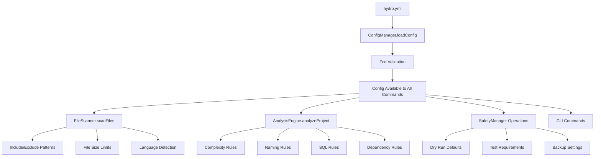

# How Hydro Works: YAML Configuration Analysis

This document provides a comprehensive analysis of how the `hydro.yml` configuration system works and its impact on the codebase.

## Overview

The `hydro.yml` configuration system is a brilliant design that creates a powerful, centralized way to control and customize Hydro's behavior across all aspects of code analysis and project management. This document explores how it works and its impact on the codebase.

## How the YAML Process Works

### 1. **Configuration Loading & Validation**
```typescript
// ConfigManager uses cosmiconfig to find and load hydro.yml
const explorer = cosmiconfigSync('hydro');
const result = explorer.search(searchPath);
const validatedConfig = HydroConfigSchema.parse(result.config);
```

The system:
- **Auto-discovers** `hydro.yml` files using `cosmiconfig`
- **Validates** configuration with Zod schemas to ensure type safety
- **Provides defaults** when no config exists
- **Supports inheritance** and environment-specific overrides

### 2. **Configuration Application Flow**

The configuration flows through the system as follows:



**Key Flow Points:**
- Configuration is loaded once and shared across all components
- Each component uses relevant parts of the configuration
- Safety settings control operational behavior
- Analysis rules determine what gets flagged as issues

## Key Impact Areas

### 1. **File Discovery & Filtering** 🎯
The `scan` configuration has **immediate impact** on what gets analyzed:

```yaml
scan:
  include: ['src', 'lib', 'app']
  exclude: ['node_modules', 'dist', 'build']
  maxFileSize: 1048576  # 1MB limit
```

**Impact**: Controls which files are processed, preventing analysis of irrelevant files and improving performance.

**Example Configuration:**
```yaml
scan:
  include:
    - src
    - lib
    - app
    - "**/*.ts"
    - "**/*.js"
  exclude:
    - node_modules
    - dist
    - build
    - "**/*.min.js"
  maxFileSize: 1048576  # 1MB
  followSymlinks: false
```

### 2. **Analysis Rules & Quality Gates** 🔍
Each rule type directly influences analysis behavior:

**Complexity Rules**:
```yaml
rules:
  complexity:
    maxFunctionLines: 120
    maxCyclomaticComplexity: 10
    maxParameterCount: 5
```

**Impact**: These thresholds determine what gets flagged as issues, directly affecting code quality standards.

**Naming Rules**:
```yaml
rules:
  naming:
    style: camelCase
    exceptions: ['API_KEY', 'DATABASE_URL']
```

**Impact**: Enforces consistent naming conventions across the entire codebase.

**SQL Rules**:
```yaml
rules:
  sql:
    dialect: postgres
    maxQueryLength: 10000
    allowRawQueries: false
```

**Impact**: Ensures SQL queries follow database-specific best practices and security guidelines.

**Dependency Rules**:
```yaml
rules:
  dependencies:
    upgradeStrategy: safe
    allowedLicenses:
      - MIT
      - Apache-2.0
    blockedPackages:
      - lodash
      - moment
```

**Impact**: Controls dependency management and prevents use of problematic packages.

### 3. **Safety & Operational Control** 🛡️
The `safety` configuration provides **critical operational control**:

```yaml
safety:
  dryRunDefault: true
  applyRequiresTests: true
  backupBeforeChanges: true
  maxFilesPerOperation: 100
```

**Impact**: Prevents accidental changes, ensures test coverage, and limits operation scope.

**Safety Features:**
- **Dry Run Default**: Operations run in preview mode by default
- **Test Requirements**: Changes require passing tests before application
- **Backup Creation**: Automatic backups before destructive operations
- **Operation Limits**: Maximum files per operation to prevent system overload

### 4. **CI/CD Integration** ⚙️
```yaml
hooks:
  preCommit:
    - hydro fmt --check
    - hydro analyze --cycles
  ci:
    provider: github
    workflow: .github/workflows/hydro-ci.yml
```

**Impact**: Automates quality checks in development workflow and CI pipelines.

**Integration Benefits:**
- **Pre-commit Hooks**: Automatic quality checks before commits
- **CI Pipeline Integration**: Seamless integration with GitHub, GitLab, CircleCI, Jenkins
- **Workflow Automation**: Consistent quality standards across all environments
- **Team Collaboration**: Shared quality standards enforced automatically

## Maximizing Configuration Impact

### 1. **Environment-Specific Configurations**

Use different rules for different environments to balance development speed with production quality:
```yaml
environments:
  development:
    safety:
      dryRunDefault: false
    rules:
      complexity:
        maxFunctionLines: 150  # More lenient in dev
  
  production:
    safety:
      dryRunDefault: true
      maxFilesPerOperation: 10  # Very conservative
    rules:
      complexity:
        maxFunctionLines: 80   # Strict in production
```

### 2. **Team-Specific Rules**

Define organization-wide standards for dependencies, licensing, and code quality:
```yaml
rules:
  dependencies:
    upgradeStrategy: safe
    blockedPackages:
      - lodash  # Use native methods instead
      - moment  # Use date-fns instead
    allowedLicenses:
      - MIT
      - Apache-2.0
```

### 3. **Advanced Plugin Integration**

Extend Hydro's capabilities with custom analyzers and commands:
```yaml
advanced:
  plugins:
    analyzers:
      - name: business-logic-analyzer
        path: ./plugins/business-logic.js
        config:
          strictMode: true
```

### 4. **Comprehensive Monitoring**.

Set up notifications and integrations for continuous quality monitoring:
```yaml
advanced:
  notifications:
    slack:
      webhook: https://hooks.slack.com/services/YOUR/SLACK/WEBHOOK
      channel: "#dev-quality"
  integrations:
    sonarqube:
      url: https://sonarqube.company.com
      projectKey: your-project
```

## Key Design Principles

### 1. **Type Safety with Zod** 🔒
- Configuration is validated at runtime using Zod schemas
- Prevents configuration errors from causing runtime failures
- Provides clear error messages for invalid configurations

### 2. **Hierarchical Configuration** 📊
- Supports environment-specific overrides
- Allows different rules for dev/staging/production
- Enables gradual rollout of stricter standards

### 3. **Extensible Plugin System** 🔌
- Configuration can drive custom analyzers and commands
- Makes Hydro truly extensible for specific project needs
- Supports both built-in and third-party plugins

### 4. **Safety-First Approach** 🛡️
- Built-in dry-run defaults prevent accidental changes
- Comprehensive safety checks and rollback capabilities
- Test requirements before applying changes

### 5. **Performance Optimization** ⚡
- Configuration drives batch processing strategies
- Concurrency limits and caching based on config
- Memory management and resource optimization

## Best Practices & Recommendations

### Getting Started
1. **Start with Comprehensive Rules**: Define strict but reasonable rules for complexity, naming, and dependencies
2. **Enable Safety Features**: Always use dry-run defaults and test requirements
3. **Set Up CI Integration**: Automate quality checks in your development workflow

### Advanced Usage
4. **Use Environment Overrides**: Different rules for different environments
5. **Monitor and Iterate**: Use the notification system to track quality metrics over time
6. **Custom Plugins**: Develop project-specific analyzers for unique requirements

### Team Adoption
7. **Gradual Rollout**: Start with basic rules and gradually increase strictness
8. **Documentation**: Document your configuration choices and rationale
9. **Training**: Ensure team members understand the configuration system

## Conclusion

The `hydro.yml` system is indeed brilliant because it provides a **single source of truth** for code quality standards while being flexible enough to adapt to different project needs and team preferences. It transforms Hydro from a simple analysis tool into a comprehensive code quality management platform.

**Key Benefits:**
- **Centralized Control**: All quality standards in one place
- **Team Consistency**: Shared standards across all developers
- **Environment Flexibility**: Different rules for different contexts
- **Safety & Reliability**: Built-in protections against accidental changes
- **Extensibility**: Custom analyzers and commands for specific needs

This configuration-driven approach makes Hydro not just a tool, but a **development culture enforcer** that helps teams maintain high code quality standards consistently.